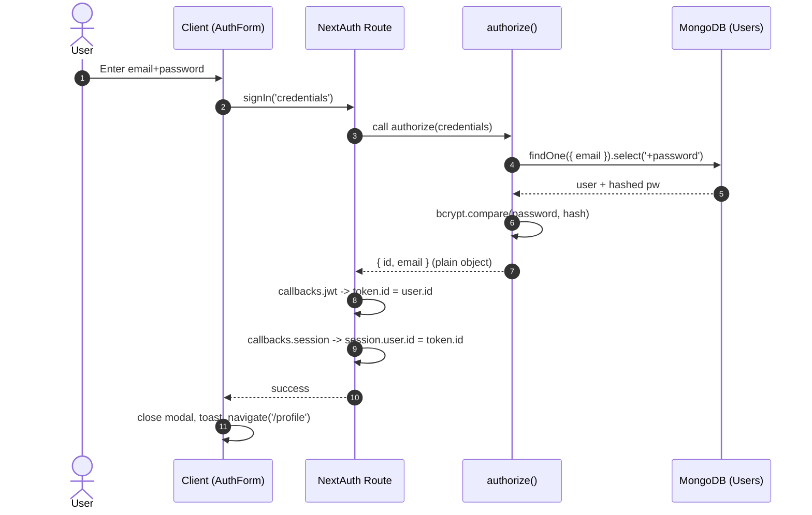

# Authentication Flow Overview

This document explains how authentication works in this project: what happens on sign up and sign in, which files are involved, and how sessions are managed.

## Key Files
- Client UI
  - src/components/auth-form.tsx
  - context/AuthModalContext.tsx
- API routes
  - src/app/api/auth/register/route.ts (Sign Up)
  - src/app/api/auth/[...nextauth]/route.ts (NextAuth handler)
- Auth configuration
  - src/lib/auth.ts (NextAuth Options, Credentials provider, callbacks)
- Database
  - src/lib/db.ts (Mongoose/MongoDB connection)
  - src/models/User.ts (User model schema)

## Required Environment Variables
- MONGODB_URI: MongoDB connection string used by Mongoose and MongoClient.
- NEXTAUTH_SECRET: Secret used by NextAuth for session/JWT signing.

These are loaded by the dev script from .env.local and .env.

---

## Sign Up Flow (Create Account)

High level
1) User fills the Sign Up tab in the AuthForm (email, password).
2) Client calls POST /api/auth/register with JSON payload.
3) API connects to MongoDB, validates input, hashes password, creates a User.
4) API returns 201 Created. UI then switches to Sign In and pre-fills email.

Details
- Client: src/components/auth-form.tsx
  - onSignUp(values)
    - POST '/api/auth/register' with { email, password }.
    - If !response.ok, shows toast error (includes server message when available).
    - On success (201), shows toast, switches active tab to "sign-in", and pre-fills sign-in email.

- API: src/app/api/auth/register/route.ts
  - Ensures dbConnect() runs (src/lib/db.ts) to connect to MongoDB once and reuse the connection.
  - Validates email and password presence.
  - Checks for existing user by email. If found, returns 409 Conflict.
  - Hashes password with bcrypt.hash(password, 10) and creates the User.
  - Returns 201 with minimal user data { email } and success: true.

- Model: src/models/User.ts
  - email: unique, validated format.
  - password: select: false so it is not returned by default queries.
  - createdAt stored for reference.

---

## Sign In Flow (Credentials)

High level
1) User fills the Sign In tab in the AuthForm.
2) Client calls signIn('credentials', { email, password, redirect: false }).
3) NextAuth invokes the CredentialsProvider.authorize() function.
4) authorize() connects to MongoDB, looks up user with password explicitly selected, compares bcrypt hash.
5) On success, authorize() returns a plain object { id, email }.
6) NextAuth runs callbacks:
   - jwt callback adds token.id = user.id
   - session callback attaches session.user.id = token.id and may hydrate extra fields (createdAt)
7) Client receives success, closes modal, navigates to /profile, refreshes.

Details
- Client: src/components/auth-form.tsx
  - onSignIn(values)
    - signIn('credentials', { redirect: false, email, password })
    - If result.error, shows toast "Invalid email or password"
    - On success: closes auth modal, shows toast, router.push('/profile'), router.refresh()

- NextAuth route: src/app/api/auth/[...nextauth]/route.ts
  - Exposes the NextAuth handler with the configured authOptions as both GET and POST.

- Auth config: src/lib/auth.ts
  - providers: [CredentialsProvider]
    - credentials: { email, password }
    - async authorize(credentials)
      - await dbConnect()
      - Validates presence of email/password.
      - const user = await User.findOne({ email }).select('+password')
      - If no user: throw new Error('No user found with this email.')
      - const isPasswordMatch = await bcrypt.compare(credentials.password, user.password)
      - If mismatch: throw new Error('Incorrect password.')
      - Return a plain serializable object: { id: user._id.toString(), email: user.email }
        - Important: NextAuth expects authorize() to return a serializable user; Mongoose docs cannot be returned directly.
  - session: { strategy: 'jwt' }
  - pages: signIn: '/' (UI is on the homepage modal)
  - callbacks:
    - async jwt({ token, user })
      - If user exists (first sign-in), attach token.id = user.id
      - Return token
    - async session({ session, token })
      - If token and session.user exist: session.user.id = token.id
      - Optionally re-connect and fetch additional DB data (e.g., createdAt) to enrich session.user
      - Return session

---

## Session/JWT Handling
- Session strategy is 'jwt' so no database session persistence is required.
- After sign-in:
  - token.id holds the user ID.
  - session.user.id is set for client consumption.
  - Optionally, session.user.createdAt is hydrated from the DB in the session callback.
- Client can call /api/auth/session to read the session and determine if a user is logged in.

---

## Database Connection Management
- src/lib/db.ts implements a hot-reload-safe singleton pattern for Mongoose:
  - cached.conn and cached.promise prevent creating multiple connections during dev HMR.
  - On connect, logs diagnostic messages for visibility.
  - If connect fails, resets cached.promise and rethrows error.
- Also exports a shared MongoClient via clientPromise for any use cases that prefer the native driver.

---

## Error Handling and UX
- Registration endpoint returns specific statuses:
  - 400: Missing email or password
  - 409: User already exists
  - 201: Created
  - 500: Unexpected errors (message included when available)
- Login path throws errors in authorize(); NextAuth surfaces them to the client signIn() result as result.error.
- The UI presents friendly toasts and keeps interactions within a modal.

---

## Common Customizations
- Add OAuth providers: Extend providers in src/lib/auth.ts (e.g., GoogleProvider) and configure env vars.
- Extend session user shape: Add fields in callbacks.session; make sure they are serializable and minimal.
- Password reset/forgot password: Currently, the UI links to email support. Implement routes and email flows as needed.

---

## Quick Reference: Sequence

Sign Up
- AuthForm -> POST /api/auth/register -> dbConnect -> User.create(hashed) -> 201 -> switch to Sign In

Sign In (Credentials)
- AuthForm -> signIn('credentials') -> NextAuth Credentials.authorize -> dbConnect -> User.find +password -> bcrypt.compare -> return { id, email } -> callbacks.jwt -> callbacks.session -> client navigates

---

## Testing Locally
- Ensure .env/.env.local contain MONGODB_URI and NEXTAUTH_SECRET.
- Start dev server: npm run dev (serves on http://localhost:9002)
- Use the Auth modal on the homepage to register then sign in.

---

## Logout Flow

High level
- Client calls signOut() from next-auth/react.
- NextAuth clears the session (JWT cookie) and redirects if desired.

Client example (TSX)
```
"use client";
import { signOut, useSession } from "next-auth/react";
import { Button } from "@/components/ui/button";

export function UserMenu() {
  const { data } = useSession();
  return (
    <div>
      <span>{data?.user?.email}</span>
      <Button onClick={() => signOut({ callbackUrl: "/" })}>Logout</Button>
    </div>
  );
}
```

Notes
- With JWT strategy, no DB logout is needed. The cookie is invalidated and the client is redirected.

---

## Protecting Routes & APIs

Options
- Client-side: useSession() to gate UI and redirect unauthenticated users.
- Server-side: getServerSession() inside server components or API routes.
- Middleware: add a middleware.ts to enforce auth across specific paths.

Server component/page example (Next.js App Router)
```
// app/profile/page.tsx (server by default)
import { getServerSession } from "next-auth";
import { authOptions } from "@/lib/auth";
import { redirect } from "next/navigation";

export default async function ProfilePage() {
  const session = await getServerSession(authOptions);
  if (!session) redirect("/");

  return <div>Welcome, {session.user?.email}</div>;
}
```

API route protection example
```
// app/api/secure/route.ts
import { NextResponse } from "next/server";
import { getServerSession } from "next-auth";
import { authOptions } from "@/lib/auth";

export async function GET() {
  const session = await getServerSession(authOptions);
  if (!session) return NextResponse.json({ error: "Unauthorized" }, { status: 401 });
  return NextResponse.json({ ok: true });
}
```

Middleware enforcement (optional)
```
// middleware.ts (project root)
import { withAuth } from "next-auth/middleware";

export default withAuth({
  pages: { signIn: "/" },
});

export const config = {
  matcher: ["/profile", "/settings", "/api/secure/:path*"],
};
```

Notes
- Middleware ensures requests never reach the page/API without a valid session.
- Keep the matcher minimal to avoid protecting public assets by mistake.

---

## Adding OAuth Providers (e.g., Google)

Steps
1) Install provider if needed (most are included with next-auth).
2) Create OAuth credentials on the provider side.
3) Add env vars to .env.local:
   - GOOGLE_CLIENT_ID=...
   - GOOGLE_CLIENT_SECRET=...
4) Update src/lib/auth.ts providers array.

Code changes (src/lib/auth.ts)
```
import GoogleProvider from "next-auth/providers/google";

export const authOptions: NextAuthOptions = {
  providers: [
    GoogleProvider({
      clientId: process.env.GOOGLE_CLIENT_ID!,
      clientSecret: process.env.GOOGLE_CLIENT_SECRET!,
    }),
    CredentialsProvider({
      // ...existing credentials config
    }),
  ],
  // ...rest unchanged
};
```

UI: add a "Continue with Google" button that triggers signIn("google").
```
import { signIn } from "next-auth/react";
<Button variant="outline" onClick={() => signIn("google", { callbackUrl: "/profile" })}>
  Continue with Google
</Button>
```

Notes
- When combining OAuth + Credentials with JWT strategy, callbacks.jwt and callbacks.session still run. You can normalize user data in callbacks.

---

## Simple Sequence Diagrams (Text)

Sign Up
- UI -> POST /api/auth/register { email, password }
- API -> dbConnect -> User.create(hashed)
- API -> 201 Created -> UI switches to Sign In

Sign In (Credentials)
- UI -> signIn('credentials', { email, password })
- NextAuth -> authorize() -> dbConnect -> User.find(+password) -> bcrypt.compare
- authorize() -> { id, email }
- callbacks.jwt -> token.id = user.id
- callbacks.session -> session.user.id = token.id (+optional fields)
- UI -> navigate to /profile

Logout
- UI -> signOut()
- NextAuth -> clears session cookie -> redirect to '/'

Protected Page Load
- Request /profile
- middleware (optional) checks session -> allow or redirect to '/'

---

## Client Utilities Quick Reference
- useSession(): read session/reactive state on client.
- signIn(provider, options): start auth flow; with credentials, returns result with error on failure.
- signOut(options): clear session and (optionally) redirect.

## Server Utilities Quick Reference
- getServerSession(authOptions): read session in server components/API routes.
- authOptions (src/lib/auth.ts): single source of truth for providers and callbacks.

---

## Implementation Notes and Recent Changes

1) Route protection and auth UX
- Added middleware.ts to protect /profile, /settings, and secure APIs (/api/posts, /api/user). Unauthenticated users are redirected to '/'.
- Refactored the header to a server-rendered component that reads the session on the server (src/components/server-header.tsx). This guarantees the header shows the correct state:
  - Authenticated: Dashboard button
  - Unauthenticated: Sign Up Free (opens modal via a tiny client component: src/components/SignUpButton.tsx)
- Moved the header into the application layout so it renders on all pages (src/app/layout.tsx).
- Updated homepage client header remnants to avoid stale UI.

2) Session configuration and dev-only logout on restart
- In src/lib/auth.ts:
  - session.strategy = 'jwt'
  - session.maxAge = 7 days, updateAge = 24 hours
  - Development-only secret rotation: secret is derived from NEXTAUTH_SECRET + process.pid. This invalidates sessions each time the dev server restarts (dev only). Production uses NEXTAUTH_SECRET as-is.

3) Profile persistence and ImageKit
- Extended User model with username, title, bio, image, and reset password fields (src/models/User.ts).
- New API: GET/PUT /api/user (src/app/api/user/route.ts) for reading/updating profile fields.
- Profile page (src/app/profile/page.tsx):
  - Loads user and posts after auth
  - Avatar edit triggers file picker -> POST /api/upload (ImageKit) -> persists image URL via PUT /api/user
  - Save Changes updates username/title/bio

4) Password management
- Change password: POST /api/auth/change-password (src/app/api/auth/change-password/route.ts). Validates current password and updates hash.
- Forgot/reset password flow:
  - POST /api/auth/forgot-password to create a token (hashed in DB) and send reset email
  - POST /api/auth/reset-password to verify token+expiry and set a new password
  - New reset page: /reset-password (src/app/reset-password/page.tsx)

5) Email delivery
- Uses Nodemailer. Behavior:
  - If SMTP envs present (SMTP_HOST, SMTP_PORT, SMTP_USER, SMTP_PASS, EMAIL_FROM, optional EMAIL_FROM_NAME, REPLY_TO): send real emails via your provider (e.g., Brevo).
  - Otherwise: automatically falls back to a free Ethereal test account and logs a Preview URL in server logs.
- We added support for EMAIL_FROM_NAME so emails display like: "Caption Craft <ai.captioncraft@outlook.com>".

6) Environment variables recap
- Required for app:
  - NEXTAUTH_SECRET, NEXTAUTH_URL, MONGODB_URI
- ImageKit upload:
  - IMAGEKIT_PUBLIC_KEY, IMAGEKIT_PRIVATE_KEY, IMAGEKIT_URL_ENDPOINT
- Email (optional for dev; required for real emails):
  - SMTP_HOST, SMTP_PORT, SMTP_USER, SMTP_PASS, EMAIL_FROM, EMAIL_FROM_NAME (optional), REPLY_TO (optional)

7) Security and behavior summary
- Unauthenticated users cannot access /profile, /settings, or secure APIs. Middleware blocks and redirects to '/'.
- Header always reflects real server-side auth state.
- In development, restarting the server logs users out due to dev-only secret rotation. In production, sessions last maxAge (default 7 days) unless signOut() is used.

8) Testing checklist
- Log out from /profile or clear site data, then verify the homepage shows Sign Up Free.
- Try going to /profile while logged out; you should be redirected to '/'.
- Sign in; header shows Dashboard; /profile loads and allows profile save and avatar upload.
- Change password from /settings and re-login with the new password.
- Forgot password: use the sign-in modal link. With SMTP configured (e.g., Brevo), check your inbox; without SMTP, check server logs for the Ethereal preview URL.

---

# Deep Dive: Auth Architecture (with diagrams and emojis)

## 1) High-level Map 🗺️

```
[Client (React)]  --(Credentials)-->  [/api/auth/[...nextauth]] --(authorize)--> MongoDB
     |                                                             |
     |-- Sign Up -> [/api/auth/register] -> Hash+Create User ------+
     |
     |-- Forgot -> [/api/auth/forgot-password] -> Email (Brevo/Ethereal)
     |-- Reset  -> [/api/auth/reset-password]  -> Update Password
     |
     |-- Profile -> [/api/user] (GET/PUT)
     |-- Upload  -> [/api/upload] -> ImageKit CDN
```

- Server header (SSR) checks session and renders the correct CTA (Dashboard vs Sign Up Free)
- middleware.ts protects server routes before they execute

## 2) End-to-end Sign In 🔐



Notes:
- We always return a plain serializable object from authorize().
- Session strategy is JWT (no DB session table).

## 3) Session Lifecycle ⏳

- Strategy: JWT
- maxAge: 7 days (configurable)
- updateAge: 24 hours (claims refresh limit)
- Development-only: secret rotates per server process (includes process.pid) so dev restarts invalidate all sessions.

State machine (simplified):
```
[Unauthenticated]
   | signIn OK
   v
[Authenticated (JWT cookie present)]
   | maxAge exceeded or signOut
   v
[Unauthenticated]
```

## 4) Middleware Decision Flow 🚧

```
Request -> middleware.ts
  ├─ Path matches protected? (/profile, /settings, /api/posts, /api/user)
  │   ├─ Yes -> has valid session?
  │   │   ├─ Yes -> allow
  │   │   └─ No  -> redirect('/')</n>
  │   └─ No  -> allow
```

Effects:
- Blocks server work earlier than route code
- Guarantees no flash of protected UI when unauthenticated

## 5) Data Model 🧬 (Users)

```
User {
  email: string (unique)
  password: string (hashed, select: false)
  username?: string
  title?: string
  bio?: string
  image?: string (ImageKit URL)
  resetPasswordToken?: string (hashed, select: false)
  resetPasswordExpires?: Date
  createdAt: Date
}
```

- Password is always hashed with bcrypt (10 rounds) on registration and when changing/resetting

## 6) Password Flows 📨

Change Password (authenticated):
```
Client -> POST /api/auth/change-password { currentPassword, newPassword }
Server -> verify current (bcrypt.compare) -> hash new -> save
```

Forgot/Reset (unauthenticated):
```
Client -> POST /api/auth/forgot-password { email }
Server -> create random token -> store hashed token + expiry -> send email
Email -> Link to /reset-password?token=...&email=...
Client -> POST /api/auth/reset-password { email, token, newPassword }
Server -> verify token+expiry -> hash new -> clear token -> save
```

Email transport:
- If SMTP_* envs present -> Brevo (or any SMTP): real delivery
- Else -> Ethereal test account with Preview URL logged to console
- From header uses EMAIL_FROM_NAME + EMAIL_FROM

## 7) Image Upload Flow 🖼️

```
Profile Avatar Button -> file input -> POST /api/upload (FormData)
Server -> ImageKit SDK .upload(buffer) -> returns URL
Client -> updates preview + PUT /api/user { image: url }
```

## 8) Server-rendered Header (SSR) 🧭

- src/components/server-header.tsx runs on the server
- Uses getServerSession(authOptions)
- Renders:
  - If session -> Dashboard button
  - Else -> small client SignUpButton that opens modal
- Ensures the CTA always matches real auth status, even after cookie changes or hard reloads

## 9) Error Handling & UX 🧯

- Sign-in errors: invalid credentials -> toast; no user found -> toast
- Register errors: 400 (missing), 409 (exists), 500 (unexpected)
- Upload errors: 400 (no file), 500 (ImageKit)
- Forgot/reset: 200 even if email not found (avoid user enumeration)

## 10) Security Checklist ✅

- [x] Password hashed at rest (bcrypt)
- [x] Credentials provider returns plain user
- [x] JWT session with httpOnly cookies (managed by NextAuth)
- [x] Middleware protects sensitive paths
- [x] Dev-only secret rotation to avoid stale sessions in development
- [x] No user enumeration in forgot-password
- [x] Sensitive envs in .env/.env.local (never logged)

## 11) Tuning & Customization 🎛️

- Session lifetimes: adjust maxAge/updateAge in src/lib/auth.ts
- Add providers: extend providers[] (Google, GitHub, etc.)
- Enrich session: add fields in callbacks.session (ensure serializable)
- Add CSRF: NextAuth includes CSRF for credential callback endpoints
- Rate-limiting (optional): add middleware for auth endpoints if needed

## 12) Dev Tips 🧪

- Clear Site Data for the app origin when testing logout states
- In dev, server restart should log you out automatically (secret rotation)
- Check server console for Ethereal Preview URLs when SMTP isn’t configured
- Test protected routes directly (e.g., open /profile in a fresh private window)

---
